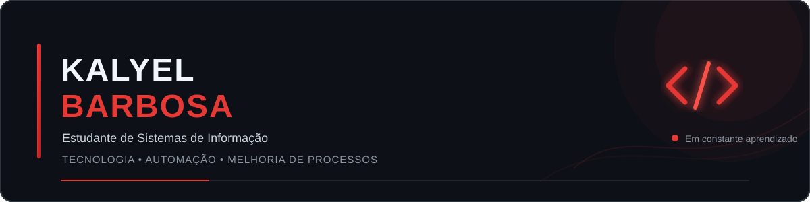

  

## 👨‍💻 Sobre mim

Estudante do **2º semestre de Sistemas de Informação**, interessado em usar tecnologia para automatizar processos, melhorar rotinas e resolver problemas reais.

🏢 **Atuação:** RCA Multiserviços  
🎓 **Formação:** Sistemas de Informação — 2º semestre  
📊 **Experiência prática:** Excel  
💻 **Estudando:** C / C++  
🎯 **Foco:** Tecnologia, automação e melhoria de processos

---

## 🧠 Conhecimentos atuais

<table>
  <tr>
    <td align="center" width="220">
      
      <b>📊 Excel</b> 
      Experiência prática
    </td>
    <td align="center" width="220">
      <b>💻 Portugol</b> 
      Fundamentos de lógica
    </td>
  </tr>
</table>

Uso **Excel** no ambiente profissional para organização, controle e melhoria de processos.  
Também tive contato com **Portugol**, onde desenvolvi fundamentos de lógica de programação.

Tenho experiência prática com **Excel** no ambiente profissional e utilizei **Portugol** durante meus estudos para desenvolver fundamentos de lógica de programação.

---

## 📚 Atualmente estudando

  
  
  

🎓 Cursando o **2º semestre de Sistemas de Informação**.

---

## 💡 Áreas de interesse

`Automação de processos` • `Desenvolvimento de sistemas` • `IA` • `Melhoria de processos` • `Tecnologia aplicada a problemas reais`

---

## 🚀 Projetos em destaque

<table>
  <tr>
    <td width="50%">
      <h3>🔴 Projetos profissionais</h3>
      
Soluções voltadas à automação e melhoria de processos do ambiente corporativo.

      Em organização e documentação.
    </td>
    <td width="50%">
      <h3>🎓 Projetos acadêmicos</h3>
      
Projetos desenvolvidos durante minha formação em Sistemas de Informação.

      Em breve.
    </td>
  </tr>
</table>

---

## 📈 Minha jornada

Este GitHub registra minha evolução na área de tecnologia, desde os primeiros fundamentos até projetos cada vez mais completos.

  <i>Aprendendo, construindo e evoluindo um projeto de cada vez.</i>

