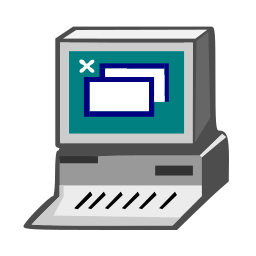

  

## 👨‍💻 Sobre mim

Estudante do **2º semestre de Sistemas de Informação**, interessado em usar tecnologia para automatizar processos, melhorar rotinas e resolver problemas reais.

🏢 **Atuação:** RCA Multiserviços  
🎓 **Formação:** Sistemas de Informação — 2º semestre  
📊 **Experiência prática:** Excel  
💻 **Estudando:** C / C++  
🎯 **Foco:** Tecnologia, automação e melhoria de processos

---

## 🧠 Conhecimentos atuais

<table>
<tr>
<td align="center" width="220">
 
<strong>Excel</strong> 
Experiência prática
</td>
<td align="center" width="220">
 
<strong>Visualg / Portugol</strong> 
Fundamentos de lógica
</td>
</tr>
</table>

Uso **Excel** no ambiente profissional para organização, controle de informações e melhoria de processos.

Tive contato com **Visualg / Portugol** durante meus estudos, desenvolvendo fundamentos de lógica de programação.

---

## 📚 Atualmente estudando

  
  
  

🎓 Cursando o **2º semestre de Sistemas de Informação**.

---

## 💡 Áreas de interesse

`Automação de processos` • `Desenvolvimento de sistemas` • `Inteligência Artificial` • `Melhoria de processos` • `Tecnologia aplicada a problemas reais`

---

## 🚀 Projetos em destaque

<table>
  <tr>
    <td width="50%" valign="top">
      <h3>🔴 Projetos profissionais</h3>
      
Soluções desenvolvidas a partir de necessidades reais de automação e melhoria de processos.

      🚧 Em organização e documentação
    </td>

    <td width="50%" valign="top">
      <h3>🎓 Projetos acadêmicos</h3>
      
Projetos e atividades desenvolvidos durante minha formação em Sistemas de Informação.

      📚 Em breve
    </td>
  </tr>
</table>

---

## 📈 Minha jornada

Este GitHub registra minha evolução na área de tecnologia, desde os primeiros fundamentos até projetos cada vez mais completos.

Aqui pretendo documentar não apenas códigos, mas também projetos que representem **aprendizado, evolução e aplicação da tecnologia na resolução de problemas reais**.

 

  <b>Aprendendo • Construindo • Evoluindo</b>

  Um projeto de cada vez.

